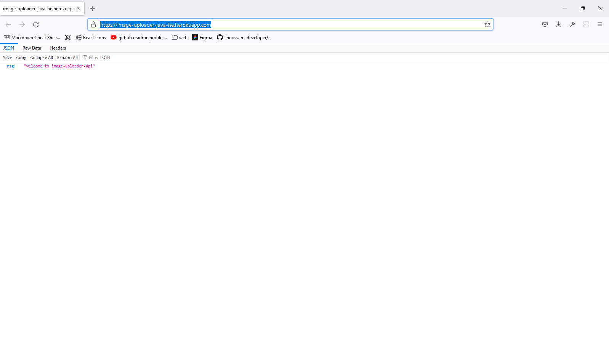

<!-- Please update value in the {}  -->

<h1 align="center">Image Uploader Backend (Spring Boot)</h1>

<div align="center">
   Solution for a challenge from  <a href="http://devchallenges.io" target="_blank">Devchallenges.io</a>.
</div>

<div align="center">
  <h3>
    <a href="https://image-uploader-java-he.herokuapp.com/">
      Demo
    </a>
    <span> | </span>
    <a href="https://github.com/houssam-developer/image-uploader-backend-java">
      Solution
    </a>
    <span> | </span>
    <a href="https://devchallenges.io/challenges/O2iGT9yBd6xZBrOcVirx">
      Challenge
    </a>
  </h3>
</div>

<!-- TABLE OF CONTENTS -->

## Table of Contents

- [Overview](#overview)
  - [Built With](#built-with)
- [Features](#features)
- [How to use](#how-to-use)
- [Contact](#contact)
- [Acknowledgements](#acknowledgements)

<!-- OVERVIEW -->

## Overview



:satellite: Image Uploader Backend is the API for the [Image Uploader App] (https://github.com/houssam-developer/image-uploader).

Image Uploader app can be found here: "https://image-uploader-java-he.herokuapp.com/".
Thanks to that challenge, I learn to work efficiently in order to succeed.
And I hope to make more beautifuls websites and become an expert in full-stack developmemt :)

### Built With

<!-- This section should list any major frameworks that you built your project using. Here are a few examples.-->

- [Java 17] (www.java.com)
- [Spring] (https://spring.io/)
- [Hibernate] (https://hibernate.org/)
- [H2] (https://www.h2database.com/html/main.html)
- [Lombok] (https://projectlombok.org/)


## Features

<!-- List the features of your application or follow the template. Don't share the figma file here :) -->

This application/site was created as a submission to a [DevChallenges](https://devchallenges.io/challenges) challenge. The [challenge](https://devchallenges.io/challenges/O2iGT9yBd6xZBrOcVirx) was to build an application to complete the given user stories.

Challenge: Create an Image Uploader application. Use any front-end libraries of your choice. Create your API. Don’t look at the existing solution. Fulfill user stories below:

- User story: I can drag and drop an image to upload it
- User story: I can choose to select an image from my folder
- User story: I can see a loader when uploading
- User story: When the image is uploaded, I can see the image and copy it
- User story: I can choose to copy to the clipboard

Icon: https://google.github.io/material-design-icons/

## How To Use

<!-- Example: -->

To clone and run this application, you'll need [Git](https://git-scm.com) and [Node.js](https://nodejs.org/en/download/) (which comes with [npm](http://npmjs.com)) installed on your computer. From your command line:

```bash
# Clone this repository
$ git clone https://github.com/houssam-developer/image-uploader-backend-java

# Install dependencies
$ mvn clean install

```

## Acknowledgements

<!-- This section should list any articles or add-ons/plugins that helps you to complete the project. This is optional but it will help you in the future. For example -->

- [Java 17] (www.java.com)
- [Spring] (https://spring.io/)
- [Hibernate] (https://hibernate.org/)
- [H2] (https://www.h2database.com/html/main.html)
- [Lombok] (https://projectlombok.org/)


## Contact

- Website [image-uploader-java-he.herokuapp.com/](https://image-uploader-java-he.herokuapp.com/)
- GitHub [@houssam-developer](https://github.com/houssam-developer/image-uploader-backend-java)